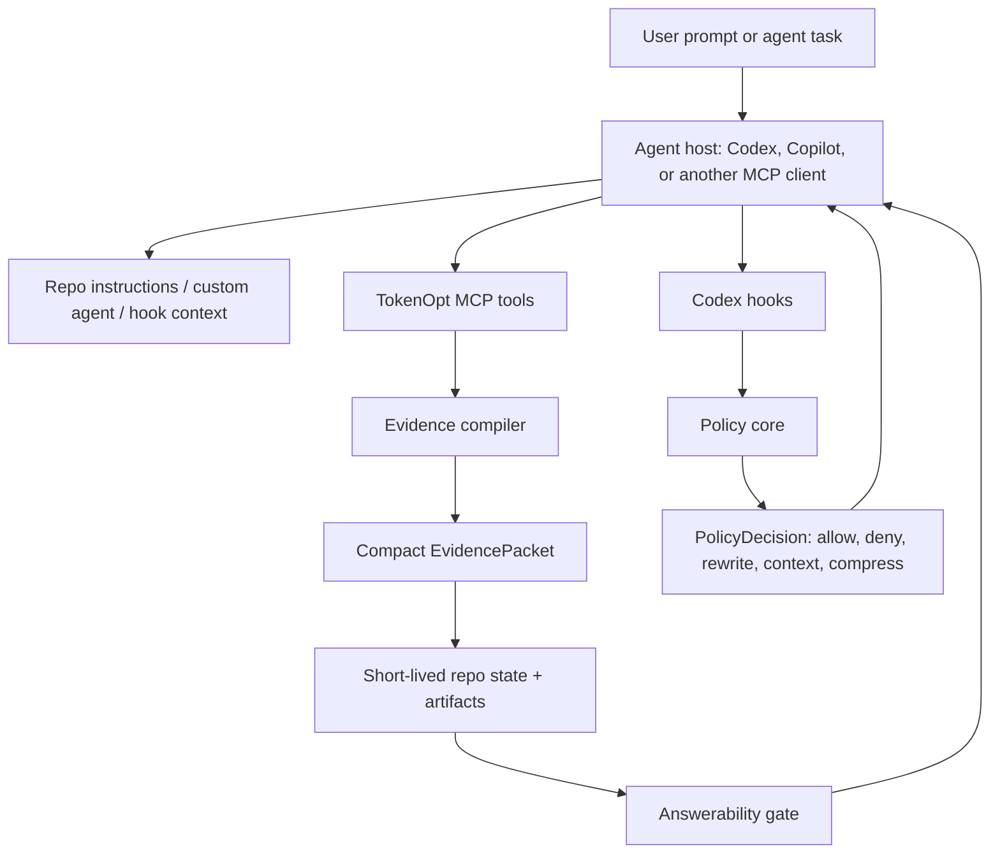

# TokenOpt Project Overview

TokenOpt is a context-budget middleware for coding agents. Its job is to reduce wasted model context by steering agents toward the cheapest evidence path before they read, search, or execute too much.

The project started from a practical problem: coding agents often spend large amounts of input tokens on broad repository scans, repeated shell output, full-file reads, generated files, lockfiles, and duplicated exploration. TokenOpt tries to prevent that by adding a reusable policy layer, MCP tools, instruction installers, and benchmark tooling.

## Project Idea

The core idea is simple:

```text
Choose the cheapest evidence path first.
```

TokenOpt is not meant to be used blindly before every task. It is a cost gate:

```text
Broad repo/business/planning task -> TokenOpt cost gate.
Exact code/call graph task -> CodeGraph or narrow search/read.
Known file/class task -> native narrow search/read.
Review current diff -> diff context first.
No task should repeat the same evidence acquisition through TokenOpt + shell + CodeGraph.
```

When TokenOpt works well, it replaces broad exploration with a compact evidence packet. When it is forced onto exact code-level work and the agent still falls back to shell or CodeGraph, it increases token usage instead of reducing it.

## Problem It Solves

TokenOpt targets these failure modes:

- Agents run broad `rg --files`, recursive grep, full repo listings, or full file reads.
- Agents inspect lockfiles, generated files, build artifacts, and large low-signal files.
- Agents run large test/build commands and paste noisy output into the model context.
- Agents call MCP tools and then repeat the same exploration through shell.
- Agents keep searching after an evidence packet already says `answerable=true`.
- Benchmarks claim optimization without checking answer quality or fallback behavior.

## Non-Goals

TokenOpt is not:

- A full repository indexer.
- A replacement for CodeGraph or symbol/call-graph tools.
- A hard enforcement layer for every host environment.
- A guarantee that Copilot will always call MCP from natural prompts.
- A universal "always call this first" router.

It works best when the agent host supports hooks, MCP tools, or strict tool configuration.

## Main Surfaces

| Surface | Purpose |
| --- | --- |
| `tokenopt mcp` | Exposes TokenOpt MCP tools for evidence compilation, bounded search, bounded reads, and optional command execution. |
| `tokenopt hook codex ...` | Codex hook adapter for prompt guidance, tool-use policy, output compression, and compaction metadata. |
| `tokenopt exec -- <command>` | Runs a command, preserves raw output, and emits a compact model-visible summary. |
| `tokenopt setup copilot` | Installs Copilot MCP config plus repo instructions, path-specific instructions, a custom agent profile, and `AGENTS.md`. |
| `tokenopt instructions ...` | Emits or installs reusable agent guidance. |
| `tokenopt benchmark ...` | Runs deterministic and Codex CLI benchmark scenarios. |
| `tokenopt doctor ...` | Checks setup, hook files, MCP config, and command paths. |

## How It Works

TokenOpt has five main layers:



### 1. Configuration

Configuration is loaded in this order:

```text
built-in defaults -> ~/.tokenopt/config.json -> <repo>/.tokenopt/config.json -> env/CLI flags
```

The default policy includes:

- Deny generated/build-output reads.
- Deny lockfile reads.
- Deny broad repository searches.
- Rewrite expensive test commands through `tokenopt exec`.
- Inject prompt guidance that treats TokenOpt as a cost gate.

### 2. Event Normalization

For Codex hooks, raw host events are normalized into `TokenOptEvent`:

```text
UserPromptSubmit -> user-prompt-submit
PreToolUse       -> pre-tool-use
PostToolUse      -> post-tool-use
PreCompact       -> pre-compact
```

The policy core then returns a `PolicyDecision`:

```text
allow    -> do nothing
deny     -> block the tool/prompt
rewrite  -> replace tool input, such as wrapping a test command through tokenopt exec
context  -> add guidance/context
compress -> replace noisy tool output with a compact summary
```

### 3. MCP Evidence Compilation

The central MCP tool is:

```text
tokenopt_compile_evidence
```

It builds an `EvidencePacket`:

```text
task
task_type
answerable
confidence
coverage
evidence
missing
answer_contract
allowed_followups
disallowed_followups
recommended_next_action
max_additional_calls
token_budget
```

The default MCP response is compact. It returns a small `packetSummary` in structured content, while the full packet is stored under the TokenOpt artifact/state path. Full packet output is available only when explicitly requested for debugging or benchmark reports.

### 4. Answerability Gate

When a packet is `answerable=true` and `recommended_next_action=answer_now`, TokenOpt writes short-lived repo state. Later redundant TokenOpt searches, reads, or commands can be gated with a compact response telling the agent to answer from the packet.

Codex hooks can also block shell grep/search after an answerable packet. MCP alone cannot disable a host shell tool, so strict enforcement depends on the host configuration.

### 5. Bounded Search And Reads

TokenOpt MCP exposes bounded context acquisition:

```text
tokenopt_search
tokenopt_read_file
```

Search providers are tried in this order:

```text
rg -> git -> built-in Node scanner
```

This means `rg` is helpful but not required.

### 6. Command Output Compression

`tokenopt exec -- <command>` captures raw command output, stores it as an artifact, and emits a compact summary. The compressor recognizes common output types:

```text
Vitest, Jest, Pytest, TypeScript, ESLint, generic logs
```

This keeps the model-visible output small while preserving full logs for human inspection.

## MCP Modes

TokenOpt MCP defaults to lite mode:

```text
tokenopt_compile_evidence
tokenopt_search
tokenopt_read_file
```

Full mode adds:

```text
tokenopt_run_command
tokenopt_project_facts
```

Lite mode is the safer default because MCP tool schemas also consume model context. Full mode should be enabled only when command execution and standalone project facts are intentionally exposed.

## Copilot Integration

`tokenopt setup copilot` installs multiple routing surfaces:

```text
.github/copilot-instructions.md
.github/instructions/tokenopt.instructions.md
.github/agents/tokenopt-cost-gate.agent.md
AGENTS.md
<home>/.copilot/mcp-config.json
```

These files improve the chance that Copilot chooses TokenOpt automatically, but they do not create a hard guarantee. If Copilot does not load the instructions or custom agent, it may ignore TokenOpt unless the user mentions it.

Recommended checks:

```text
/mcp show tokenopt
/agent
```

Also verify that Copilot response references include `.github/copilot-instructions.md` or `.github/instructions/tokenopt.instructions.md`.

## TokenOpt, CodeGraph, And Native Search

TokenOpt is intentionally independent from CodeGraph. CodeGraph can be an optional context provider, but TokenOpt's core policy and evidence model do not depend on it.

| Task Type | Cheapest first path |
| --- | --- |
| Repo overview | TokenOpt |
| Business/domain summary | TokenOpt |
| Build/daily handoff | TokenOpt |
| Implementation planning | TokenOpt first if broad, CodeGraph if ownership is unknown |
| Unit-test planning | TokenOpt first if broad, CodeGraph/native search if target class is known |
| Exact flow trace | CodeGraph or native narrow search/read |
| Specific class/method deep dive | CodeGraph or native narrow search/read |
| Current diff review | Diff context first |
| Known-file implementation | Native narrow search/read |

The main anti-pattern is:

```text
TokenOpt first -> CodeGraph -> shell search for the same evidence
```

That pattern increases input tokens.

## Typical Runtime Flows

### Broad Business Summary

```text
User asks for a broad business/domain explanation.
Agent calls tokenopt_compile_evidence once.
TokenOpt extracts docs, repo facts, capabilities, project areas, glossary signals, and quality contract.
If answerable=true, agent answers from packet.
No shell fallback.
```

### Exact Code Flow Trace

```text
User asks to trace a specific runtime flow line by line.
Agent skips TokenOpt-first.
Agent uses CodeGraph or narrow search/read to follow entrypoint, service, domain, persistence, and tests.
TokenOpt is used only if a broad summary is needed first.
```

### Test Or Build Output

```text
Agent wants to run a broad/noisy test command.
Pre-tool-use policy rewrites through tokenopt exec when hooks are active.
tokenopt exec stores raw output and returns compact failure signals.
Agent reads the summary instead of a full log dump.
```

### Copilot Broad Task

```text
Copilot loads repo instructions or tokenopt-cost-gate agent.
Copilot sees the task is broad.
Copilot calls tokenopt_compile_evidence once.
Copilot answers from the packet if answerable.
```

If Copilot does not load the instruction/custom agent, the user may need to mention:

```text
Use the tokenopt-cost-gate agent if available.
```

## Project Modules

| File | Responsibility |
| --- | --- |
| `src/cli.ts` | CLI command routing. |
| `src/config.ts` | Config defaults, precedence, and env overrides. |
| `src/policy-core.ts` | Deterministic policy decisions for prompts, tool use, output compression, and compaction metadata. |
| `src/codex-adapter.ts` | Codex hook input/output normalization. |
| `src/mcp.ts` | TokenOpt MCP server, evidence compiler, bounded search/read, project facts, command tool. |
| `src/exec.ts` | Wrapped command execution and compact output. |
| `src/log-compressor.ts` | Test/build/log compression. |
| `src/evidence-state.ts` | Short-lived answerability state. |
| `src/observability.ts` | Artifact and event storage. |
| `src/instruction-audit.ts` | Instruction snippet generation, install, and audit. |
| `src/copilot-setup.ts` | Copilot MCP config and instruction setup. |
| `src/doctor.ts` | Setup verification. |
| `src/benchmark.ts` | Deterministic acquisition benchmark. |
| `src/codex-benchmark.ts` | Codex CLI benchmark runner. |
| `src/suite-benchmark.ts` | Multi-task benchmark suite runner. |

## What Optimization Means

TokenOpt should be judged by end-to-end cost and quality, not by whether an MCP tool was called.

Useful metrics:

```text
input_tokens
cached_input_tokens
output_tokens
tool_calls
mcp_calls
shell_calls
tool_input_chars
tool_output_chars
fallback_after_answerable
quality_score
quality_checks
```

A good TokenOpt run usually has:

- Fewer broad shell/search calls.
- Lower model-visible tool output.
- No fallback after `answerable=true`.
- Equivalent or better answer quality.

A bad TokenOpt run has:

- TokenOpt call plus shell fallback for the same evidence.
- TokenOpt call plus CodeGraph call for the same evidence.
- Large full structured packets returned by default.
- Prompt text that includes benchmark or injected-instruction artifacts.

## Limitations

- Copilot custom instructions and custom agents are soft routing signals.
- MCP does not automatically disable host shell tools.
- Hooks depend on the host firing and trusting hook definitions.
- TokenOpt does not replace exact symbol/call-graph tools.
- TokenOpt can increase tokens if forced onto the wrong task type.

## Recommended Prompt Pattern

```text
Choose the cheapest evidence path first.

If this is a broad repo/business/planning task and TokenOpt MCP is available, use TokenOpt as a cost gate:
- Call tokenopt_compile_evidence once.
- If answerable=true, answer from the packet and do not call shell/search/read/CodeGraph again for the same evidence.
- If answerable=false, use only its allowed TokenOpt followups.

If this is an exact code-flow/class/method/PBI task that needs line-level proof, do not call TokenOpt first. Use CodeGraph or narrow search/read directly.

Never do TokenOpt first and then repeat the same exploration with shell, search, or CodeGraph.

Start the answer with:
Acquisition path:
Reason:
Fallback used:

Task:
<your real task>
```

For more task-specific examples, see [PROMPT_PLAYBOOK.md](PROMPT_PLAYBOOK.md).

## Current Status

V1 is Codex-first and supports Copilot through MCP plus instruction/custom-agent setup. Native Copilot hooks are not implemented yet. The package is designed as a global npm CLI with per-repo config and user-cache artifacts so one install can work across many repositories.
