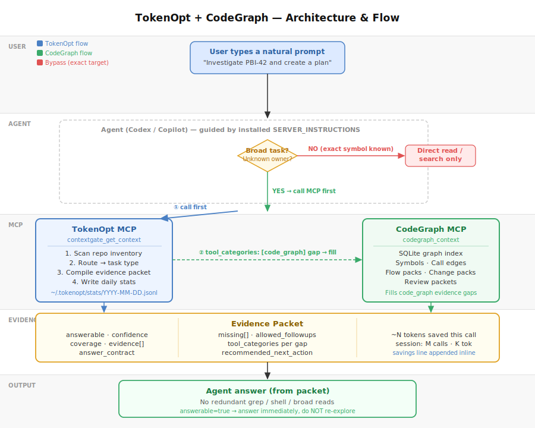

# TokenOpt Architecture & Flow



## Overview

TokenOpt is an MCP server that sits between the AI agent and the repository. Its job is to answer the question _"what evidence does the agent need?"_ before the agent starts exploring, so the agent can answer from a single bounded packet instead of running open-ended greps.

As of June 2026, TokenOpt includes an **optional internal CodeGraph bridge** — when `codegraph.enabled = true` in config, `contextgate_get_context` automatically calls CodeGraph as a subprocess and folds symbol-level evidence into the packet. The model sees a single tool call and a single combined packet.

## Layers

```
User natural prompt
        │
        ▼
Agent (Codex / Copilot)
  guided by SERVER_INSTRUCTIONS / AGENTS.md / copilot-instructions.md
        │
        ├── Broad / unknown-owner task?
        │       │
        │       ▼
        │   contextgate_get_context (TokenOpt MCP)
        │       1. scan repo inventory (git ls-files, manifest)
        │       2. classify task type (investigate / implement / review_diff / …)
        │       3. compile evidence packet
        │       4. [if codegraph.enabled] detect code_graph gap →
        │              spawn CodeGraph subprocess (MCP client SDK) →
        │              call codegraph_context(task) →
        │              merge flow steps + slices into packet →
        │              remove gap from missing[]
        │       5. append inline savings line
        │       6. write daily stats → ~/.tokenopt/stats/YYYY-MM-DD.jsonl
        │
        │   → Agent answers from combined packet (1 tool call)
        │
        └── Exact file / symbol already known?
                │
                ▼
            Direct read / search — no MCP needed
```

## Setup modes

| Mode | Install | Quality | Tokens | Notes |
| --- | --- | :---: | ---: | --- |
| **TokenOpt only** (default) | 1 MCP | 0.990 | ~2 200 | Best all-round. Wins 12/12 tasks. |
| TokenOpt + internal bridge | 1 MCP + `codegraph.enabled=true` + CodeGraph CLI | ≥0.990 | ~2 500 | Adds symbol-level call graph for gap tasks. |
| TokenOpt + CodeGraph (dual MCP) | 2 MCPs | 0.990 | ~6 600 | Same quality but 3× tokens. Not recommended. |
| CodeGraph only | 1 MCP | 0.709 | ~4 600 | Fails on build-handoff and review-diff. |
| Baseline (no MCP) | 0 | 0.838 | ~6 300 | 3–6 tool calls per task. |

**Recommendation for users:** install only TokenOpt MCP. If you have CodeGraph available and need symbol-level accuracy, set `codegraph.enabled = true` in `~/.tokenopt/config.json` and point `TOKENOPT_CODEGRAPH_CLI` to the CodeGraph CLI. TokenOpt will auto-bridge — no model-side changes needed.

## Evidence Packet Fields

| Field | Purpose |
| --- | --- |
| `answerable` | true = agent MUST answer now, no re-exploration |
| `confidence` | routing certainty |
| `coverage` | fraction of evidence slots filled |
| `evidence[]` | structured facts (owner, files, symbols, tests, risks) |
| `answer_contract` | what the agent must include in the answer |
| `missing[]` | unfilled slots with `tool_categories` hints |
| `allowed_followups[]` | the only tool calls permitted after this packet |
| `recommended_next_action` | prose guidance for next step |
| `codeGraphEnrichment` | present when internal bridge ran (flowSteps, slices counts) |

## Policy Gates

TokenOpt hooks into the agent lifecycle at four events:

| Event | What it enforces |
| --- | --- |
| `user-prompt-submit` | inject guidance; block secrets; gateway policy for PBI tasks |
| `pre-tool-use` | block `codegraph_context` before ContextGate or when no gap; block broad search after answerable packet; block lockfiles/generated files |
| `post-tool-use` | compress noisy output (test runs, build logs) |
| `agent-stop` | gateway: block final answer if PBI task never called ContextGate |

### CodeGraph coordination (new in June 2026)

When `codegraph.enabled = true` (internal bridge active):
- `codegraph_context` is **always blocked** from the model — it should never call it directly
- TokenOpt handles CodeGraph internally

When `codegraph.enabled = false` (external/dual-MCP mode):
- `codegraph_context` is **guided** with ordering rules: call ContextGate first, only call CodeGraph when the packet has a `code_graph` gap
- Calling CodeGraph before ContextGate → context warning
- Calling CodeGraph when no code_graph gap exists → context warning

## Session Stats

Every `contextgate_get_context` call:
- Increments `SESSION_STATS.calls` / `evidenceTokensEst` / `inventoryTokensAvoided`
- Appends an inline savings line to the response text:
  ```
  ---
  TokenOpt: ~8 400 tokens saved this call vs raw exploration | session: 3 call(s), ~24 000 total tokens saved
  ```
- Persists a JSONL record to `~/.tokenopt/stats/YYYY-MM-DD.jsonl`

Run `tokenopt report` for a 30-day dashboard.

## Internal CodeGraph Bridge

When `codegraph.enabled = true` in config (or `TOKENOPT_CODEGRAPH_CLI` env var is set):

1. `contextgate_get_context` compiles the inventory packet as normal
2. After compilation, reads the evidence state to check `allowed_followups[].tool_categories`
3. If any followup has `tool_categories: ["code_graph"]`, spawns the CodeGraph CLI as a subprocess via `@modelcontextprotocol/sdk/client`
4. Calls `codegraph_context(task, budgetTokens=2000, profile=compact)` on the child process
5. Parses `flowSteps` + `evidenceSlices` from the response
6. Merges them into the response text as a "CodeGraph enrichment" section
7. Removes filled code_graph gaps from `strictGaps`
8. Kills the child process

CLI discovery order:
1. `config.codegraph.cliPath` (explicit config file)
2. `TOKENOPT_CODEGRAPH_CLI` env var (path or command name)
3. `TOKENOPT_CODEGRAPH_ROOT` env var + `/dist/cli.js`
4. `../code-graph/dist/cli.js` or `../codegraph/dist/cli.js` (sibling directory)
5. `codegraph` on PATH

## Benchmark Results (2026-06-26)

6 tasks × 2 repos × 4 modes (baseline · codegraph-only · compiled-packet · tokenopt-codegraph).

| Mode | Avg quality | Avg tok (doughnut) | Avg tok (tokenopt) | Tool calls | MCP calls |
| --- | :---: | ---: | ---: | :---: | :---: |
| baseline | 0.838 | 6 146 | 6 312 | 3 – 6 | 0 |
| codegraph-only | 0.709 | 6 089 | 3 207 | 1 | 1 (CG) |
| **compiled-packet** | **0.990** | **2 182** | **2 216** | **1** | **1 (TO)** |
| tokenopt-codegraph | 0.990 | 8 056 | 5 241 | 2 | 2 (TO+CG) |

Token reduction: **−64 % average** vs baseline (range −47 % to −80 %).
Quality improvement: **+15 %** vs baseline (0.838 → 0.990).

`compiled-packet` wins all 12/12 task × repo combinations.

A new benchmark mode `tokenopt-internal-codegraph` is available to validate the bridge:
```bash
node dist/cli.js benchmark suite --suite examples/suite.json \
  --repo /path/to/repo --mode tokenopt-internal-codegraph
```
This uses only the TokenOpt MCP; if `TOKENOPT_CODEGRAPH_CLI` is set, the bridge is invoked internally.

See [`benchmark-results/daily-2026-06-26.md`](../benchmark-results/daily-2026-06-26.md) for the full table.
